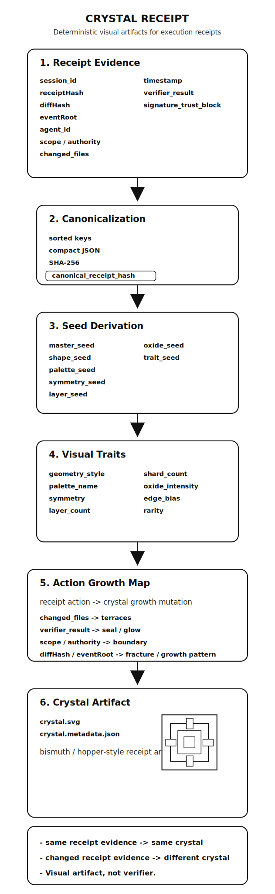

# crystal-receipt

## ReceiptOS

**Portable proof and history artifacts for AI agents, tools, workflows, and autonomous systems.**

```text
evidence
→ proof
→ portable_proof_object.v0
→ chronicle_entry.v0
→ chronicle_portfolio.v0
→ portfolio_root verification
```

## What you get

- Portable execution receipts
- Recomputable `receipt_root`
- Evidence Capsules
- Provenance Summaries
- `portable_proof_object.v0`
- `chronicle_entry.v0`
- `chronicle_portfolio.v0`
- local `portfolio_root` verification

Crystal Receipt is a producer-neutral proof packaging and export layer.
It imports evidence and proof inputs, preserves ReceiptOS-compatible proof semantics, derives canonical `receipt_root`, produces Evidence Capsules and Provenance Summaries, and exports portable proof/history artifacts for downstream systems.
The repository is organized into two layers: a producer-neutral ReceiptOS proof core and an optional crystal rendering layer built on top of it.

## Ecosystem role

Upstream:
- producer systems emit portable execution evidence or proof inputs

Crystal Receipt / ReceiptOS:
- normalizes evidence
- derives and verifies `receipt_root`
- produces Evidence Capsules / Provenance Summaries
- emits `portable_proof_object.v0`
- emits `chronicle_entry.v0`
- emits `chronicle_portfolio.v0`
- verifies `portfolio_root`

Downstream:
- Chronicle and other history systems can consume those portable artifacts as neutral history layers

In short:

```text
Evidence in. Proof out. History exported.
```

In the current architecture:
- **ReceiptOS** is the stable proof substrate
- **producers** are systems that emit execution evidence into that substrate
- **Crystal Receipt** is the proof-facing packaging / inspection / export layer built around that boundary

Crystal Receipt is **not** a Stealth frontend.
Stealth is one current supported evidence producer, alongside other producer inputs already documented in this repo.

Visual receipt language remains downstream presentation, not the core identity of the repo.

Post-quantum considerations for receipt longevity: see [pq-receipt-profile](https://github.com/pipavlo82/pq-receipt-profile).

## External producer quick start

- Read `docs/receiptos_integration_manifest_v0.md`
- Read `docs/EXTERNAL_PRODUCER_INTEGRATION_GUIDE.md`
- Run `bun scripts/demo-external-producer-e2e.ts`

## Producer coverage

ReceiptOS uses the same proof pipeline across different producer systems.

Core message:

```text
Same proof pipeline.
Different producers.
One portable proof/history model.
```

The current documented producer surface is best understood in two categories.
Stealth is one supported producer here, not the definition of the product.

### Verified against real producer data or real fixture shape
- Stealth handoff
- GitHub Actions
- Claude Code session
- generic producer
- `external.coding_run.v0`

### Schema sketch / capsule-boundary compatibility only
- Cursor session
- Codex session

All of these paths are aimed at the same ReceiptOS capsule/proof boundary.
But Cursor and Codex should currently be read more narrowly: they demonstrate ReceiptOS boundary compatibility and adapter shape, not a fully verified stable integration against documented real producer session formats.

These producers differ in runtime, workflow shape, and source semantics.
They do not get separate proof semantics.
They normalize into the same ReceiptOS proof boundary and produce the same core proof-facing artifacts:

- recomputable `receipt_root`
- `receiptos.evidence_capsule.v0`
- `receiptos.provenance_summary.v0`
- verifier-facing proof state
- replay-oriented evidence summaries

For the current support matrix, see `docs/PRODUCER_SUPPORT_MATRIX.md`.

## What this is

Crystal Receipt is no longer just a visual experiment.
Its current direction is:

- portable execution receipts
- Evidence Capsule interpretation
- ReceiptOS-compatible verification
- `receipt_root` recomputation
- `portable_proof_object.v0` export
- `chronicle_entry.v0` export
- `chronicle_portfolio.v0` creation/export
- local `portfolio_root` verification
- local Merkle proof attachment and checking
- external anchor import / anchor-path support
- optional visual rendering as a secondary presentation layer

The core idea is simple:
- a producer emits evidence
- the evidence can be verified and replayed
- the evidence can be summarized into an Evidence Capsule
- the evidence can be exported into portable proof/history artifacts
- the same evidence can optionally be rendered into a deterministic crystal artifact

The goal is **not** to replace cryptographic verification.
The goal is to make execution evidence portable, inspectable, verifiable, and human-readable.

For the current generic product flow:

```text
evidence
-> proof
-> portable_proof_object.v0
-> chronicle_entry.v0
-> chronicle_portfolio.v0
-> portfolio_root verification
```

`portfolio_root` is derived only from:
- `portfolio_version`
- `portfolio_id`
- sorted `collection_refs`

It does not include scoring, reputation, certification, ownership, NFT logic, blockchain requirements, timestamps, or UI/render-only metadata.

## Execution Provenance

Crystal Receipt is a portable execution provenance surface for agent actions.

The goal is not simply to display receipts, logs, or visual artifacts.

The goal is to make agent execution independently inspectable and verifiable:

```text
agent input
-> policy
-> authorization
-> tool/action
-> evidence
-> result
-> verifier
-> receipt
```

Crystal Receipt packages this into portable proof-facing artifacts:

- schema-valid receipts
- recomputable receipt roots
- verifier results
- proof references / anchor state
- Evidence Capsules
- replay summaries / manifests
- invariant validation
- browser-inspectable proof views

This places Crystal Receipt in the broader execution provenance category: SLSA / in-toto for software supply chain, but for autonomous agent execution.

The verifier remains the truth source.
Visual artifacts, crystal surfaces, exports, and collectibles are optional downstream presentation layers. They do not prove the work by themselves.

See:
- `docs/EXECUTION_PROVENANCE_FRAMING.md`
- `docs/receiptos_integration_manifest_v0.md`
- `docs/EXTERNAL_PRODUCER_INTEGRATION_GUIDE.md`
- `docs/PRODUCER_SUPPORT_MATRIX.md`
- `docs/PRODUCER_PROOF_CONTRACT_V0.md`
- `docs/PRODUCER_NEUTRAL_PROOF_BOUNDARY.md`
- `docs/CYPHES_RECEIPTOS_INTEGRATION_STATUS.md`
- `scripts/demo-external-producer-e2e.ts`



## Current product direction

Crystal Receipt now includes a portable ReceiptOS-aligned proof core in `src/receiptos`.

That proof core supports:

- portable evidence JSON
- schema-preserving receipt interpretation
- canonical `receipt_root` recomputation
- local Merkle proof helpers
- Sepolia anchor payload/result helpers
- Evidence Capsule view-models
- a non-visual capsule demo CLI

The visual renderer still exists and still works, but it is no longer the only or primary product story.
The receipt and proof layer comes first.

The pipeline above is the conceptual view. The flow below is the package-level view, and the concrete repo path further down is the implementation-level mapping of the same flow.

## Core flow

```text
Agent action
-> portable evidence
-> receipt_root
-> Merkle proof
-> anchor / proof references
-> verifier
-> Evidence Capsule
-> optional crystal surface
```

A more concrete interpretation path in the current repo is:

```text
payload
-> policy boundary
-> authorization
-> decision trace
-> execution
-> evidence record
-> receipt root
-> Merkle proof
-> anchor
-> replay manifest
-> verification
-> optional visual presentation
```

## ReceiptOS compatibility

Crystal Receipt is designed to stay compatible with ReceiptOS-style proof flows.

That means:
- evidence remains portable JSON
- receipt roots remain recomputable
- proof helpers remain deterministic
- Merkle / anchor state remains inspectable
- verification remains separate from presentation

Crystal Receipt does **not** redefine receipt truth.
It consumes receipt evidence and presents it.

In the current repo, this proof boundary is also producer-neutral:
- Stealth handoff, GitHub Actions, Claude Code session, generic producer, and `external.coding_run.v0` are supported against real producer data or real fixture shape in the current adapter/fixture/test surface
- Cursor session and Codex session currently demonstrate capsule-boundary compatibility in the adapter/fixture/test surface, but are not yet verified against stable, documented real producer session formats
- producers may differ in workflow model, runtime, and source semantics
- the shared Evidence Capsule / proof boundary remains stable
- producer-specific workflow logic stays outside the shared proof substrate

## Evidence Capsule

Evidence Capsule is now a first-class concept in the repo.

The capsule is a non-breaking interpretation layer over portable receipt evidence.
It does not mutate the evidence document and it does not change receipt semantics.

The current capsule model summarizes sections such as:

- payload
- policy boundary
- authorization
- decision trace
- execution
- evidence
- counterfactual / denied-action interpretation
- result
- receipt root
- Merkle proof
- anchor
- replay manifest
- verifier

Useful starting points:
- `docs/EVIDENCE_CAPSULE_MODEL_V0.md`
- `docs/CRYSTAL_RECEIPT_MAPPING_V0.md`
- `docs/receiptos_integration_manifest_v0.md`

## Verification, Merkle, and anchor path

A receipt contains structured execution evidence, for example:

- `session_id`
- task / prompt context
- execution records
- commands
- changed files
- `diff_sha256`
- `anchor.receipt_root`
- `anchor.merkle_root`
- `anchor.tx_hash`
- verifier-facing status fields

The portable proof flow is:

1. canonicalize receipt evidence
2. recompute `receipt_root`
3. compare against stored `anchor.receipt_root`
4. attach / verify local Merkle proof when present
5. prepare anchor payloads or import anchor results when needed
6. summarize the result as a capsule / proof surface

The verifier remains the source of truth.
The capsule and crystal layers are interpretive and presentational.
Producer identity (runtime, generated_by, source metadata) is provenance metadata, not proof truth.

## Important security boundary

Crystal Receipt is not the security verifier.
It does not replace:

- signature verification
- hash checks
- replay protection
- policy checks
- scope / authority checks
- Merkle verification
- anchor verification
- trust-chain verification

Correct statement:

> The artifact does not prove the work by itself.  
> It represents receipt evidence that can be independently verified.

## External Producer E2E Demo

The fastest runnable example of the producer-neutral ReceiptOS integration flow.
Run `bun scripts/demo-external-producer-e2e.ts` for a minimal generic producer example that walks through normalization, `receipt_root` computation, Evidence Capsule generation, and Provenance Summary generation.
Run `bun scripts/demo-external-coding-run-e2e.ts` for the first concrete external coding-agent/tool-run producer example.

### Where do Viewer artifacts come from?

ReceiptOS artifacts are produced by the import/demo scripts or by a producer integration. The Viewer can inspect those generated JSON files directly from your computer; files stay local in the browser and are not uploaded.

Example:

```bash
bun scripts/receiptos-import-producer.ts \
 --producer github-actions \
 --input src/receiptos/fixtures/github-actions-run.sample.json \
 --out out/github-actions-demo
```

Then open the ReceiptOS Viewer and load files from `out/github-actions-demo/`:

- `evidence-capsule.v0.json` — primary artifact
- `provenance-summary.v0.json` — optional provenance summary
- `capsule-summary.json` — optional richer viewer summary
- `normalized-evidence.json` — optional producer/runtime context

Existing committed examples live under `examples/receipt-examples/`, and real producers or CI systems can publish the same files as build artifacts.

Current committed Viewer examples now include both proof-state examples and producer-specific ReceiptOS bundles generated from existing fixtures/import paths. The proof-state examples remain useful for clean/tampered/anchored integrity surfaces, while the producer-specific bundles make the shared multi-producer proof model directly visible in the Viewer.

## Current CLI modes

### Hash mode

The original MVP remains available:

```bash
python generate.py --hash <receiptHash> --out examples/demo
```

This produces a deterministic crystal from a single hash input.

### Receipt mode

Receipt-derived generation is now available:

```bash
python generate.py --receipt examples/receipt-demo/receipt.json --out examples/receipt-demo
```

This loads receipt JSON, canonicalizes it, derives seeds and visual traits, and writes:
- `crystal.svg`
- `crystal.metadata.json`

### ReceiptOS Capsule Demo

A non-visual proof/capsule summary can also be generated from portable ReceiptOS evidence fixtures produced by different source systems.

```bash
bun scripts/receiptos-capsule-demo.ts --evidence src/receiptos/fixtures/session-evidence.with-local-merkle.sample.json --out examples/receiptos-capsule-demo/capsule-summary.json
```

Input fixture:
- `src/receiptos/fixtures/session-evidence.with-local-merkle.sample.json`

Output artifacts:
- `examples/receiptos-capsule-demo/capsule-summary.json`
- `examples/receiptos-capsule-demo/evidence-capsule.v0.json`

Schema v0:
- `schemas/evidence-capsule.v0.schema.json`
- `docs/EVIDENCE_CAPSULE_SCHEMA_V0.md`

The schema-valid `evidence-capsule.v0.json` file is proof-first and non-visual.
This demo does not change the SVG renderer and does not change receipt root semantics.

Additional static example sets now live under:
- `examples/receipt-examples/clean-local-proof/`
- `examples/receipt-examples/tampered-mismatch/`
- `examples/receipt-examples/anchored-proof/`
- `examples/receipt-examples/index.json`

Example semantics:
- `clean-local-proof` is a live verifier input example.
- `tampered-mismatch` is a live verifier input example and should report a mismatch clearly.
- `anchored-proof` is a static example artifact set showing imported anchor state.
- The current verifier CLI verifies portable evidence input and does not yet recompute/import anchor overlay from the `anchored-proof` example folder.

### Generic Producer Import CLI

A generic external producer output can also be normalized into the current ReceiptOS input path and reduced into proof artifacts.
This is the current producer-neutral import path.
`receipt_root` is computed independently of the top-level `anchor`; see `bun scripts/demo-external-producer-e2e.ts` for the fastest runnable example.
The repo now also includes `external-coding-run` as a concrete coding-agent/tool-run producer example.

```bash
bun scripts/receiptos-import-producer.ts \
 --producer generic \
 --input src/receiptos/fixtures/generic-producer-output.sample.json \
 --out examples/imported-producer
```

Output artifacts:
- `normalized-evidence.json`
- `capsule-summary.json`
- `evidence-capsule.v0.json`
- `provenance-summary.v0.json`

## Optional visual renderer

The crystal artifact remains relevant, but now as an optional presentation layer on top of the portable receipt/proof core.

The visual side still provides:
- deterministic rendering from stable evidence-derived inputs
- a human-facing artifact layer
- an optional certificate / collectible style surface

But the visual layer is secondary to:
- receipt evidence
- proof verification
- Merkle / anchor path
- Evidence Capsule interpretation

## Bismuth / crystal background

Earlier versions of Crystal Receipt led with the renderer and the bismuth metaphor.
That history is still relevant, but it is no longer the primary narrative.

Bismuth crystals remain a useful visual metaphor because they are structured but unique.
They grow according to rules, and small differences in conditions lead to different final forms.

Crystal Receipt uses that metaphor in a deterministic way:

```text
same evidence
+ same rules
= same artifact
```

So the crystal remains a meaningful visual fingerprint — just not the core trust layer.

## Optional export boundary

If a receipt, capsule, or visual artifact is exported to another medium, that export is still not the verifier.

Export layers may be useful for:
- portability
- public display
- discovery
- artifact history
- certificate-like presentation

But exported artifacts do not automatically prove the work.

Correct statement:

> The export does not prove the work by itself.  
> It represents receipt evidence that can be independently verified.

## What this is not

Crystal Receipt is not:

- a blockchain verifier
- a replacement for ReceiptOS verification
- a replacement for producer-side verification
- a trust oracle
- a security proof by image
- a scoring or reputation engine
- a certification system
- an ownership registry
- an NFT product
- “AI art with metadata”

It is a portable receipt/presentation layer with an optional deterministic visual grammar.

## Future direction

Future directions should prioritize execution provenance:

```text
agent execution
-> portable evidence
-> receipt_root
-> verifier result
-> Evidence Capsule
-> provenance artifact
-> optional viewer / export layer
```

Visual artifacts and exports remain useful, but they are downstream presentation layers.
Verification continues to come from receipt evidence, hashes, proofs, anchors, and verifier logic.

## Product meaning

Crystal Receipt turns invisible agent execution into a portable, inspectable provenance surface.

For agentic systems, this matters because agents perform actions:
- call tools
- change files
- spend money
- deploy code
- trade
- sign messages
- make decisions

Those actions need receipts.
Those receipts need verification.
Those verified receipts benefit from a portable, inspectable presentation layer.

A human can see:
- “This action produced this capsule / artifact.”

A system can verify:
- “This capsule came from this receipt evidence.”

A verifier can check:
- “This receipt evidence is valid or invalid.”

That separation is the key:

- verifier checks truth
- receipt stores evidence
- capsule interprets it
- crystal can present it
- optional export can make it portable

## Notes

- No blockchain submit path here
- No NFT minting code here
- No scoring or reputation layer here
- No ownership or certification layer here
- Stealth is a supported producer, not the product boundary
- No producer-specific runtime integration SDK yet
- No external paid APIs
- Visual generator remains available
- Proof/capsule layer is now first-class

## Architecture overview

Crystal Receipt now spans both:
- a portable ReceiptOS-aligned proof core
- and a deterministic visual artifact layer

The proof layer handles evidence interpretation, root verification, Merkle state, anchor state, and capsule summaries.
The image remains the human-facing fingerprint.

- `docs/receiptos_producer_neutral_architecture.svg` — current overall architecture: producers → proof boundary → receipt_root → verifier → Evidence Capsule → viewer/export/crystal
- `docs/ARCHITECTURE_OVERVIEW.md`
- `docs/crystal_receipt_mobile_flow.svg` — mobile-friendly README hero diagram
- `docs/crystal_receipt_architecture.svg` — crystal rendering pipeline diagram (visual layer only, secondary to the substrate above)

## Related docs

- `docs/EXECUTION_PROVENANCE_FRAMING.md`
- `docs/EVIDENCE_CAPSULE_MODEL_V0.md`
- `docs/CRYSTAL_RECEIPT_MAPPING_V0.md`
- `docs/RECEIPT_DERIVATION.md`
- `docs/METADATA_SCHEMA_V0_2.md`
- `docs/ROADMAP.md`

## Tests

```bash
python -m unittest discover -s tests -p "test_*.py"
bun test tests/receiptos
```
