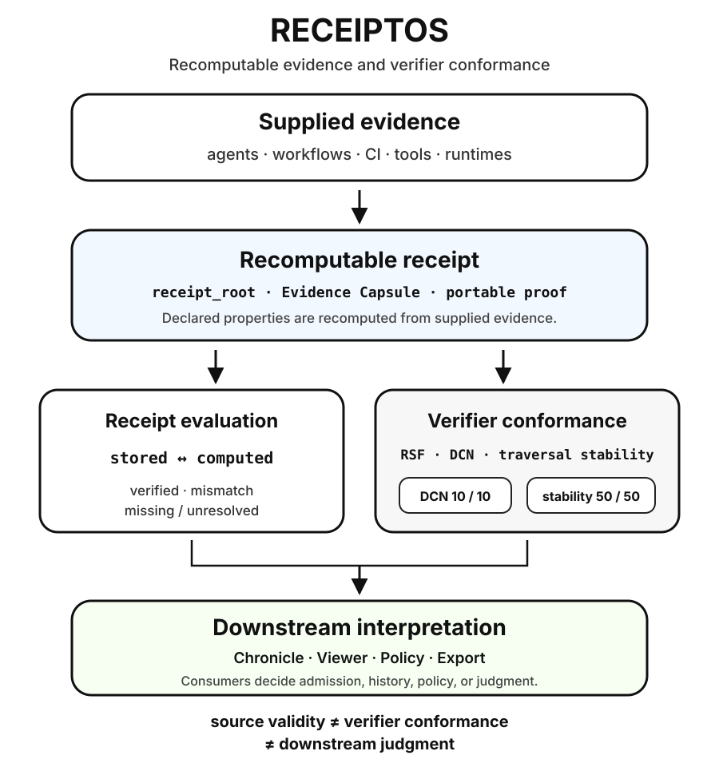

# ReceiptOS — Crystal Receipt reference implementation

[](https://doi.org/10.5281/zenodo.21895219)

ReceiptOS packages supplied execution evidence into recomputable, portable artifacts. Declared receipt properties can be independently recomputed from that evidence under selected schemas and canonicalization rules. Frozen conformance profiles evaluate whether verifier behavior matches authenticated expectations. Downstream systems decide admission, history, policy, settlement, or other judgment.

This repository is the Crystal Receipt reference implementation of that substrate: a producer-neutral proof core in `src/receiptos`, committed conformance packages under `conformance/`, and optional presentation tools built on top. It does not claim source truth, universal correctness, actor identity, authority, or real-world occurrence.

**Don't trust. Recompute.**



Receipt processing and verifier conformance are separate layers: ReceiptOS recomputes declared properties from supplied evidence, while frozen conformance profiles test whether verifier behavior matches authenticated expectations. Downstream consumers decide how those findings affect admission, history, policy, or judgment.

## What is implemented

### Recomputable evidence

The ReceiptOS proof core normalizes and canonicalizes supplied evidence without importing producer-specific business logic. Implemented surfaces include:

- canonical evidence processing
- recomputable `receipt_root`
- Evidence Capsule (`receiptos.evidence_capsule.v0`)
- Provenance Summary (`receiptos.provenance_summary.v0`)
- `portable_proof_object.v0`
- Merkle and anchor state as declared, inspectable properties
- producer-supplied verifier state treated as evidence, not authority

Independent recomputation asks whether declared properties hold for the supplied evidence. It does not establish source truth or downstream judgment.

### Recursive Singleton Fold

[Recursive Singleton Fold](docs/RECURSIVE_SINGLETON_FOLD_REFERENCE_PACKAGE_V0_WORKING_DRAFT.md) closes positions 1–28 against a committed normative conformance corpus under an exact deterministic evaluation discipline. Package inventory and related vector classes live in [docs/CONFORMANCE_INDEX.md](docs/CONFORMANCE_INDEX.md).

RSF is a bounded normative evaluation contract for the adopted corpus. It does not prove every ReceiptOS property universally.

### Counterfactual Conformance v0

[Counterfactual Conformance v0](conformance/counterfactual-conformance-v0/SPEC.md) is a bounded verifier-of-verifier evaluation over an exact frozen ten-member Deterministic Counterfactual Neighborhood. Expected results are bound by authenticated expected-result-set authority, and inputs are derived from committed sources.

Canonical aggregate:

```text
evaluated / conformant / 10 / 10 / 0 / 0
```

This is more than an ordinary test suite: neighborhood identity, expected authority, materialization, execution, comparison, and aggregate semantics are all closed under the frozen package.

### Traversal stability

[Traversal stability](conformance/counterfactual-traversal-stability-v0/SPEC.md) evaluates the same ten members under five frozen deterministic schedules. Reset model: fresh process per schedule, shared process within a schedule.

Measured result:

```text
50 stable / 0 history-sensitive / 0 unresolved
```

This does not cover every possible history or all `10!` schedule permutations.

## What the results mean

```text
source validity
≠ verifier conformance
≠ downstream judgment
```

- **Source validity** concerns whether supplied evidence supports declared properties under the selected schemas and verification profile.
- **Verifier conformance** concerns whether an implementation matches an authenticated normative corpus and frozen expected-result authority.
- **Downstream judgment** concerns what a consumer chooses to do with those findings: admission, history, policy, settlement, or other action.

Also keep these distinctions:

- unresolved execution ≠ semantic nonconformance
- package corruption ≠ semantic nonconformance
- anchor presence or state ≠ verifier verdict

## Quick verification

```bash
bun test tests/receiptos
bun conformance/counterfactual-conformance-v0/generate_package.ts --check
bun conformance/counterfactual-traversal-stability-v0/generate_package.ts --check
python conformance/counterfactual-conformance-v0/verify_independent.py
python conformance/counterfactual-traversal-stability-v0/verify_independent.py
```

Generator `--check` mode must produce zero drift against the committed packages. Independent auditors do not import the production implementation (`production_imports: 0`).

## Core artifact flow

```text
producer evidence
→ normalization and canonicalization
→ receipt_root recomputation
→ declared verification surfaces
→ Evidence Capsule / Provenance Summary
→ portable_proof_object.v0
→ Chronicle or another downstream consumer
```

Counterfactual Conformance tests verifier behavior alongside this receipt-processing architecture. It is not an inline gate required for every ordinary receipt.

## Producer neutrality and integrations

The reference implementation was developed in design partnership with Stealth (CYPHES). Stealth is one supported producer, not the product boundary. Neutrality is structural: no adapter participates in `receipt_root` derivation. Full adapter index: [docs/ADAPTERS.md](docs/ADAPTERS.md).

### Verified against real producer data or real fixture shape

- Stealth handoff
- GitHub Actions
- Claude Code session
- generic producer
- `external.coding_run.v0`

### Schema / capsule-boundary compatibility only

- Cursor session
- Codex session

Cursor and Codex currently demonstrate ReceiptOS boundary compatibility and adapter shape. They are not yet verified against stable, documented real producer session formats.

Start here:

- [docs/receiptos_integration_manifest_v0.md](docs/receiptos_integration_manifest_v0.md)
- [docs/EXTERNAL_PRODUCER_INTEGRATION_GUIDE.md](docs/EXTERNAL_PRODUCER_INTEGRATION_GUIDE.md)
- [docs/PRODUCER_SUPPORT_MATRIX.md](docs/PRODUCER_SUPPORT_MATRIX.md)
- [docs/PRODUCER_PROOF_CONTRACT_V0.md](docs/PRODUCER_PROOF_CONTRACT_V0.md)
- [docs/PRODUCER_NEUTRAL_PROOF_BOUNDARY.md](docs/PRODUCER_NEUTRAL_PROOF_BOUNDARY.md)
- [docs/CYPHES_RECEIPTOS_INTEGRATION_STATUS.md](docs/CYPHES_RECEIPTOS_INTEGRATION_STATUS.md)

## Evidence admission, verification, Merkle, and anchor boundaries

Evidence Capsule is a non-breaking interpretation layer over portable receipt evidence. It does not mutate the evidence document and does not change receipt semantics. See [docs/EVIDENCE_CAPSULE_MODEL_V0.md](docs/EVIDENCE_CAPSULE_MODEL_V0.md) and [docs/EVIDENCE_CAPSULE_SCHEMA_V0.md](docs/EVIDENCE_CAPSULE_SCHEMA_V0.md).

Typical verification path:

1. canonicalize receipt evidence
2. recompute `receipt_root`
3. compare stored and computed values
4. attach or verify local Merkle proof when present
5. import or prepare anchor state when needed
6. summarize the result as a capsule / proof surface

A verifier implements declared checks; it is not a privileged truth authority. Producer-reported `verifier_result` remains evidence and must not substitute for consumer recomputation.

Merkle and anchor fields remain declared, inspectable properties. Anchor presence or imported/prepared anchor state is not a verifier verdict and is not part of a valid/mismatch/missing vocabulary.

Published Unanchored Issuance Witness schemas and normative vectors exist, but the complete production findings evaluator for Unanchored Issuance Witness remains absent. Status: [docs/UNANCHORED_ISSUANCE_WITNESS_V0_STATUS.md](docs/UNANCHORED_ISSUANCE_WITNESS_V0_STATUS.md).

## Chronicle and downstream ecosystem

Chronicle consumes admitted proof-bearing material as a continuity/history layer. ReceiptOS does not grant Chronicle universal historical truth. Viewer, export, policy, and settlement layers interpret portable findings; they do not inherit automatic acceptance from ReceiptOS.

Downstream artifacts include `chronicle_entry.v0`, portfolio artifacts, and local portfolio/root verification. `portfolio_root` is derived only from `portfolio_version`, `portfolio_id`, and sorted `collection_refs`. It does not include scoring, reputation, certification, ownership, NFT logic, blockchain requirements, timestamps, or UI/render-only metadata.

Post-quantum considerations for receipt longevity: [pq-receipt-profile](https://github.com/pipavlo82/pq-receipt-profile).

## Integration and CLI guide

### Proof and capsule commands

```bash
bun scripts/demo-external-producer-e2e.ts
bun scripts/demo-external-coding-run-e2e.ts

bun scripts/receiptos-import-producer.ts \
  --producer generic \
  --input src/receiptos/fixtures/generic-producer-output.sample.json \
  --out examples/imported-producer

bun scripts/receiptos-import-producer.ts \
  --producer github-actions \
  --input src/receiptos/fixtures/github-actions-run.sample.json \
  --out out/github-actions-demo

bun scripts/receiptos-capsule-demo.ts \
  --evidence src/receiptos/fixtures/session-evidence.with-local-merkle.sample.json \
  --out examples/receiptos-capsule-demo/capsule-summary.json

bun scripts/export-portable-proof-object-v0.ts \
  <stealth-evidence.json> \
  <portable-proof-object-v0.json>
```

Import/demo outputs commonly include:

- `normalized-evidence.json`
- `evidence-capsule.v0.json`
- `provenance-summary.v0.json`
- `capsule-summary.json`

Committed Viewer examples live under `examples/receipt-examples/` (`clean-local-proof`, `tampered-mismatch`, `anchored-proof`, and `index.json`).

### Viewer usage

ReceiptOS artifacts are produced by import/demo scripts or by a producer integration. Open a local Viewer and load generated JSON from your machine; files stay local in the browser.

- [docs/artifact-viewer/index.html](docs/artifact-viewer/index.html)
- [docs/receipt-verifier/index.html](docs/receipt-verifier/index.html)
- [examples/artifact-viewer/index.html](examples/artifact-viewer/index.html)

Example semantics:

- `clean-local-proof` — live verifier input example
- `tampered-mismatch` — live verifier input example; should report a mismatch
- `anchored-proof` — static example showing imported anchor state

The current verifier CLI verifies portable evidence input and does not yet recompute or import anchor overlay from the `anchored-proof` example folder.

### Optional visual-renderer commands

Brief reference only; see [Optional visual crystal renderer](#optional-visual-crystal-renderer) for boundaries and explanation.

```bash
python generate.py --hash <receiptHash> --out examples/demo
python generate.py --receipt examples/receipt-demo/receipt.json --out examples/receipt-demo
```

## Repository map and documentation

| Path | Role |
| --- | --- |
| `src/receiptos/` | ReceiptOS proof core, adapters, fixtures |
| `conformance/` | Frozen conformance packages and auditors |
| `schemas/` | Published JSON schemas |
| `docs/` | Specs, guides, Viewer surfaces, architecture notes |
| `scripts/` | Import, demo, capsule, and export CLIs |
| `examples/` | Committed example bundles and Viewer samples |
| `tests/receiptos/` | ReceiptOS test suite |
| `generate.py` and related visual tooling | Optional crystal renderer |

Strong documentation entry points:

- [docs/CANONICAL_PRINCIPLES.md](docs/CANONICAL_PRINCIPLES.md)
- [docs/SCHEMA_OVERVIEW.md](docs/SCHEMA_OVERVIEW.md)
- [docs/ARCHITECTURE_OVERVIEW.md](docs/ARCHITECTURE_OVERVIEW.md)
- [docs/CONFORMANCE_INDEX.md](docs/CONFORMANCE_INDEX.md)
- [docs/EXECUTION_PROVENANCE_FRAMING.md](docs/EXECUTION_PROVENANCE_FRAMING.md)
- [docs/CRYSTAL_RECEIPT_MAPPING_V0.md](docs/CRYSTAL_RECEIPT_MAPPING_V0.md)
- [docs/RECEIPT_DERIVATION.md](docs/RECEIPT_DERIVATION.md)
- [docs/natural-precedent-dna-proofreading.md](docs/natural-precedent-dna-proofreading.md)

## Security and bounded nonclaims

These implemented checks do not establish every security property.

ReceiptOS / Crystal Receipt does **not** claim:

- a universal verifier-correctness theorem
- correctness under every possible history or all `10!` traversal orders
- source-truth or real-world-occurrence proof
- actor-identity or authority proof
- automatic downstream admission or policy decision
- certification, scoring, reputation, ownership, NFT, or marketplace systems
- security proof from an image
- that every published schema has a production evaluator
- replacement for signatures, hashes, Merkle verification, replay protection, policy checks, scope/authority checks, or anchor verification

Correct statement:

> The artifact does not prove the work by itself.
> It represents receipt evidence that can be independently verified.

Export layers may aid portability and presentation. Exported artifacts do not automatically prove the work.

## Tests and CI

```bash
python -m unittest discover -s tests -p "test_*.py"
bun test tests/receiptos
```

Committed CI includes [`.github/workflows/receiptos-export.yml`](.github/workflows/receiptos-export.yml). Do not infer broader coverage than that workflow runs.

## Citation

The current published ReceiptOS preprint (v0.8, 2026-08-11) is citable at
the Zenodo DOI below.

> Tvardovskyi, P. (2026). *ReceiptOS: Recomputable Evidence and
> Counterfactual Verifier Conformance* (Version 0.8). Zenodo.
> https://doi.org/10.5281/zenodo.21895219

BibTeX:

```bibtex
@misc{tvardovskyi2026receiptos_v08,
 author = {Tvardovskyi, Pavlo},
 title = {{ReceiptOS: Recomputable Evidence and
 Counterfactual Verifier Conformance}},
 year = {2026},
 publisher = {Zenodo},
 version = {0.8},
 doi = {10.5281/zenodo.21895219},
 url = {https://doi.org/10.5281/zenodo.21895219}
}
```

Version DOIs:

- v0.8 (current): [10.5281/zenodo.21895219](https://doi.org/10.5281/zenodo.21895219)
- v0.6 preprint (*ReceiptOS: A Portable, Recomputable Evidence Substrate for
  Verifiable Agent Execution*): [10.5281/zenodo.21402444](https://doi.org/10.5281/zenodo.21402444)
- Concept DOI (always resolves to the latest version):
  [10.5281/zenodo.21402443](https://doi.org/10.5281/zenodo.21402443)

The paper's normative canonicalization profile (receiptos-c14n-v0, §2.8)
and its byte-exact test vector are the ones implemented here.

## Optional visual crystal renderer

The visual crystal is an optional downstream presentation layer. It is not the ReceiptOS proof substrate and does not establish receipt correctness.

It remains available for:

- deterministic rendering from a hash
- receipt-derived rendering from receipt JSON
- deterministic SVG and metadata outputs
- optional visual fingerprint / presentation use
- export and display of a human-facing artifact

```bash
python generate.py --hash <receiptHash> --out examples/demo
python generate.py --receipt examples/receipt-demo/receipt.json --out examples/receipt-demo
```

Receipt mode writes `crystal.svg` and `crystal.metadata.json`. Same evidence and same rules yield the same visual artifact. That determinism is presentation-layer consistency, not proof of receipt correctness.

Related notes:

- [docs/METADATA_SCHEMA_V0_2.md](docs/METADATA_SCHEMA_V0_2.md)
- [docs/crystal_receipt_architecture.svg](docs/crystal_receipt_architecture.svg) — crystal rendering pipeline only

## Historical background: Bismuth and the original crystal renderer

Earlier versions of Crystal Receipt led with the renderer and the bismuth metaphor. That history explains the repository name and why the optional crystal generator remains available, but it is no longer the primary product narrative.

Bismuth crystals are structured yet unique: they grow according to rules, and small differences in conditions produce different final forms. Crystal Receipt used that metaphor deterministically—same evidence and same rules yield the same artifact—as a visual fingerprint over receipt-derived inputs.

Today the proof substrate comes first. The renderer remains a secondary, optional presentation tool.

See also [LICENSE](LICENSE) and [CONTRIBUTING.md](CONTRIBUTING.md).
