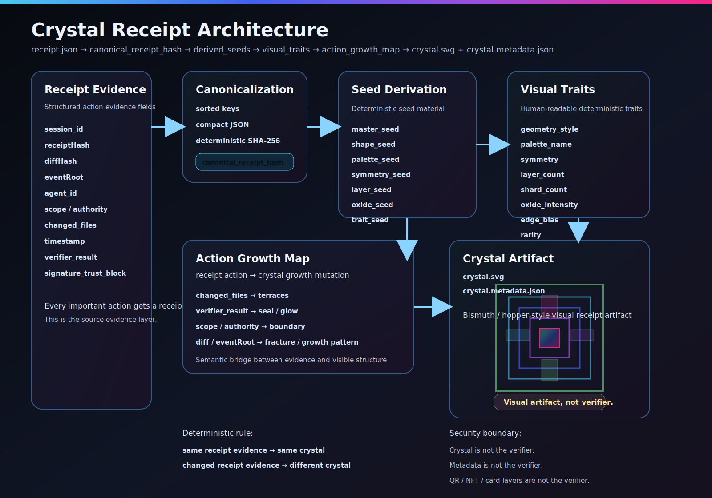

# Crystal Receipt Architecture Overview

Crystal Receipt turns execution receipt evidence into a deterministic bismuth-inspired visual artifact.

It exists because receipts are important but hard for humans to read at a glance.
A raw receipt can tell you what happened, what changed, who acted, what event root was recorded, and what verifier result was produced.
Crystal Receipt gives that evidence a stable visual form without pretending that the image itself is the proof.

## Short product framing

Every important action gets a receipt.
Every receipt gets a crystal.
Every crystal can be shared, scanned, and independently verified.

That is the product shape:

- receipts carry evidence
- crystals make that evidence visible
- metadata preserves deterministic provenance
- verification remains separate

## What Crystal Receipt is

Crystal Receipt is a deterministic visual fingerprint layer for execution receipts.

It is **not** random generative art.
It is **not** the verifier.
It is **not** a replacement for hashes, signatures, or event-root validation.

Instead, it is a pipeline that transforms structured receipt evidence into:

- a reproducible crystal image
- a reproducible metadata file
- a visual grammar that can be explained in terms of receipt evidence

## Why it exists

Execution receipts are useful, but they are often too dense for humans.
Most people will not naturally read a receipt JSON object and immediately understand its identity, shape, or significance.

Crystal Receipt exists to make receipts:

- visible
- recognizable
- portable
- shareable
- semantically meaningful

The crystal gives a receipt a human-facing identity.
The metadata preserves the deterministic explanation for how that identity was formed.

## Deterministic rule

Crystal Receipt preserves a strict identity rule:

```text
same receipt evidence -> same crystal
changed receipt evidence -> different crystal
```

That means:

- the same receipt evidence must always reproduce the same SVG and metadata
- changed receipt evidence must change the resulting identity
- uniqueness comes from evidence, not randomness
- generation must remain deterministic across machines

## Main pipeline

```text
receipt.json
-> canonicalize receipt
-> canonical_receipt_hash
-> derive seed material
-> derive visual traits
-> build action_growth_map
-> render bismuth-style crystal SVG
-> write metadata
```

## Pipeline stages explained

### 1. Receipt evidence

This is the source input.
A receipt contains structured evidence about an action or event.
Typical fields include:

- `session_id`
- `receiptHash`
- `diffHash`
- `eventRoot`
- `agent_id`
- `scope`
- `authority`
- `changed_files`
- `timestamp`
- `verifier_result`
- `signature_trust_block`

This is the evidence layer.
It describes what happened and under what conditions.

### 2. Canonical receipt hash

The receipt is first canonicalized into a deterministic representation.
That means the same logical receipt should normalize into the same compact structure.

From that canonical form, Crystal Receipt derives a `canonical_receipt_hash`.

This hash is:

- deterministic
- stable for the same evidence
- the identity anchor for downstream derivation

It is not the visual artifact itself.
It is the root digest that gives the visual system a stable identity basis.

### 3. Derived seeds

From the canonical receipt hash, Crystal Receipt derives named seed material.
This keeps downstream visual systems deterministic but separated by role.

Current seed fields include:

- `master_seed`
- `shape_seed`
- `palette_seed`
- `symmetry_seed`
- `layer_seed`
- `oxide_seed`
- `trait_seed`

These are not user-facing proof objects.
They are deterministic internal derivation inputs for the visual layer.

### 4. Visual traits

The seed material is mapped into human-readable visual traits.
This is where the renderer gets a structured visual description instead of raw hash bytes.

Current visual traits include:

- `geometry_style`
- `palette_name`
- `symmetry`
- `layer_count`
- `shard_count`
- `oxide_intensity`
- `edge_bias`
- `rarity`

These traits shape the crystal’s visible character.
They are deterministic outputs of derivation, not verifier conclusions.

### 5. `action_growth_map`

The `action_growth_map` is the semantic bridge between receipt evidence and visible growth logic.

This answers the question:

> Which receipt field is supposed to influence which kind of crystal mutation?

The core principle is:

```text
receipt action -> crystal growth mutation
```

Examples:

- `changed_files` -> terraces / branch count
- `verifier_result` -> seal / clarity / glow state
- `scope` / `authority` -> outer boundary behavior
- `diffHash` / `eventRoot` -> fracture and growth pattern

This layer does not replace rendering logic.
It documents semantic intent and makes the crystal explainable.

### 6. `crystal.svg`

`crystal.svg` is the human-facing visual artifact.
It is the visible crystal generated from deterministic evidence-derived structure.

It is meant to be:

- recognizable
- reproducible
- bismuth-inspired
- suitable for viewing, sharing, and later card/scan flows

It is not the verifier.
It is the visible fingerprint.

### 7. `crystal.metadata.json`

`crystal.metadata.json` is the machine-readable provenance layer for the artifact.
It records the deterministic identity and visual derivation context.

It can include:

- source receipt summary
- canonical receipt hash
- derived seeds
- visual traits
- action-growth mapping
- artifact role and boundary text

This metadata helps explain and reproduce the crystal.
It is still not the verifier.

## Security boundary

Crystal Receipt keeps a hard boundary between visual representation and proof.

The following are **not** the verifier:

- the crystal image
- the metadata file
- QR layers
- receipt cards
- NFT wrappers
- sharing/export layers

Verification remains separate.
Actual truth still comes from receipt evidence, hashes, signatures, `eventRoot`, and verifier logic.

**Short boundary statement:**

> Visual artifact, not verifier.

## Product framing in plain language

Crystal Receipt gives every important action a receipt-shaped visual identity.

That means:

- a tool action can produce a receipt
- the receipt can produce a deterministic crystal
- the crystal can be shared with humans
- the metadata can explain the derivation
- a verifier can still independently check the truth

This separation is the whole point:

- receipts carry evidence
- derivation creates identity
- crystals make identity visible
- metadata preserves explanation
- verifiers decide truth

## Visual diagram

The architecture diagram lives here:

- [SVG architecture diagram](./crystal_receipt_architecture.svg)

If your Markdown viewer supports inline SVG rendering, you can also view it below:


